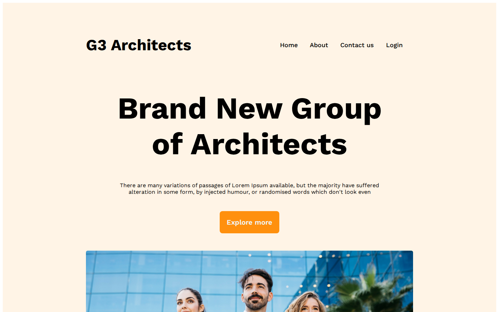

# G3 Architects — Architecture Firm Landing Page

A responsive landing page for an architecture studio, written in **pure HTML and CSS** with dedicated mobile and tablet breakpoints.

[](https://shayan-abrar.github.io/G3-Architects-Website/) <!-- live-demo -->




## Sections

- **Navbar** with the brand name, page links and login
- **Hero:** "Brand New Group of Architects", with an *Explore more* button
- **Team collage:** a photo strip of the architects
- **Features:** "Features you will love & enjoy", such as desktop and mobile versions, a drag-and-drop builder and a modern design
- **Experience badge:** 10+ years
- **Some Facts:** 54 awards, 1,458 projects finished, 590 clients and 22,578 emails sent
- **Sponsors:** Amazon, Figma, Google, Spotify and Télérama logos
- **Footer**

## Responsive Design

| Breakpoint | Layout |
| --- | --- |
| Desktop (> 992px) | Side-by-side navbar, team and facts sections |
| Tablet (576px – 992px) | Navbar, team and facts sections stack vertically |
| Mobile (< 576px) | Fully stacked: single-column team grid, sponsor logos in a column, smaller hero text |

## Tech Stack

- HTML5
- CSS3 (Flexbox, CSS Grid, media queries)
- Google Fonts (Work Sans)
- GitHub Pages for hosting

## Run Locally

```bash
git clone https://github.com/SHAYAN-ABRAR/G3-Architects-Website.git
cd G3-Architects-Website
# Open index.html in a browser
```

## Author

**Shayan Abrar** · [GitHub](https://github.com/SHAYAN-ABRAR) · [LinkedIn](https://www.linkedin.com/in/shayan-abrar/) · [Portfolio](https://shayan-abrar.vercel.app)
