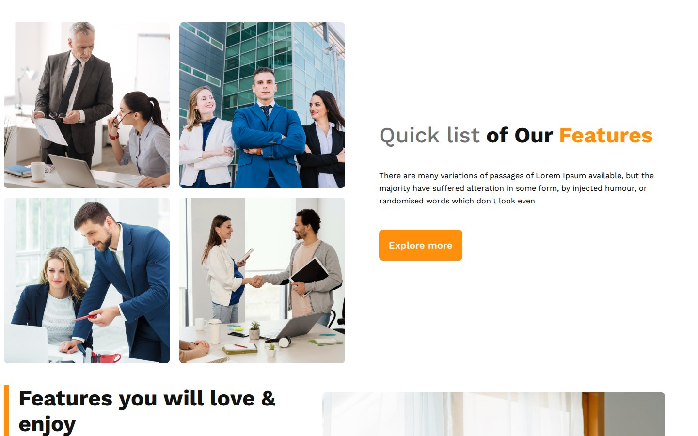
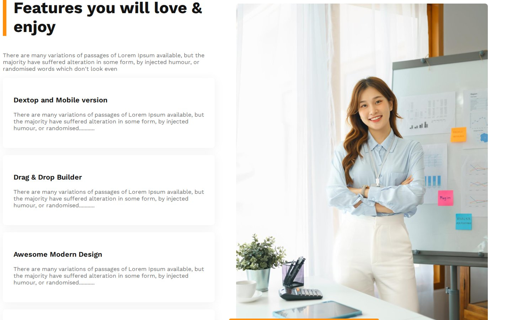
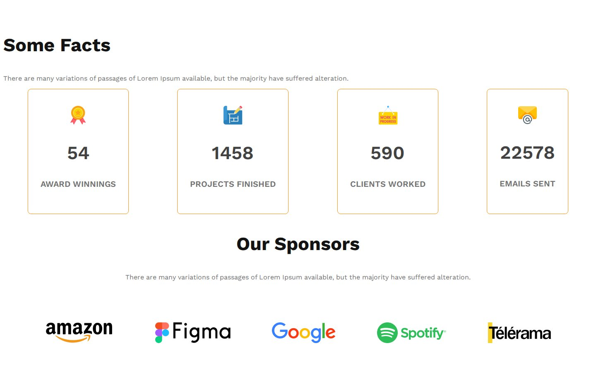

# G3 Architects

A landing page for a fictional architecture studio, written in plain HTML and CSS with phone and tablet breakpoints.

**Live site:** <https://shayan-abrar.github.io/G3-Architects-Website/>

<p align="center">
  
</p>

<table>
  <tr>
    <td align="center" width="25%"><a href="screenshots/preview.png"></a><br><sub><b>Hero</b></sub></td>
    <td align="center" width="25%"><a href="screenshots/team.jpg"></a><br><sub><b>Team grid</b></sub></td>
    <td align="center" width="25%"><a href="screenshots/features.jpg"></a><br><sub><b>Features</b></sub></td>
    <td align="center" width="25%"><a href="screenshots/facts-sponsors.jpg"></a><br><sub><b>Facts and sponsors</b></sub></td>
  </tr>
</table>

A studio's landing page needs a strong first impression, a sense of the people behind it, and a few trust signals such as experience, numbers and well-known clients. This page lays those out with Flexbox, CSS Grid and two media queries, with no framework, so the layout code is short and easy to follow.

## Quick Start

```bash
git clone https://github.com/SHAYAN-ABRAR/G3-Architects-Website.git
cd G3-Architects-Website
python3 -m http.server 8000
```

Open <http://localhost:8000>. On Windows, use `python` instead of `python3`. Opening `index.html` directly in a browser works too. The Work Sans font loads from Google Fonts, so you need an internet connection for the intended typography.

## Features

- **Hero:** navigation bar, the headline "Brand New Group of Architects", an **Explore more** button and a wide team photo.
- **Team grid:** four photos in a two-by-two CSS Grid next to a "Quick list of Our Features" block.
- **Features:** four feature cards beside an architect photo with an overlapping "10+ Year Experience" badge.
- **Some Facts:** counters for 54 awards, 1,458 projects, 590 clients and 22,578 emails sent.
- **Sponsors:** a row of partner logos.
- **Breakpoints:** below 992px the navigation, team section and fact cards stack vertically. Below 576px the team grid becomes a single column, the sponsor logos stack and the hero text shrinks.

## Customizing

The layout breakpoints live at the end of `styles.css`. This is the phone rule that turns the team grid into one column:

```css
@media screen and (max-width:576px) {
    .teams-img-container {
        grid-template-columns: 1fr;
    }
}
```

## Limitations

- The features section doesn't stack on smaller screens, so the page scrolls sideways on screens narrower than about 1,050px.
- The body copy is placeholder (lorem ipsum) text, and the navigation links and buttons don't go anywhere.
- The footer element is empty.

## Tech Stack

- HTML5
- CSS3 (Flexbox, CSS Grid and media queries) in `styles.css`
- Google Fonts: Work Sans
- Hosted on GitHub Pages

## Contributing

Suggestions and bug reports are welcome. Please [open an issue](https://github.com/SHAYAN-ABRAR/G3-Architects-Website/issues). Please read the license note below before reusing any code or images.

## License

This repository doesn't have a license yet, so it doesn't grant anyone permission to reuse or redistribute its code or images. Please ask before reusing any part of it. The sponsor logos are trademarks of their owners.

---

Built by **Shayan Abrar** · [GitHub](https://github.com/SHAYAN-ABRAR) · [LinkedIn](https://www.linkedin.com/in/shayan-abrar/)
