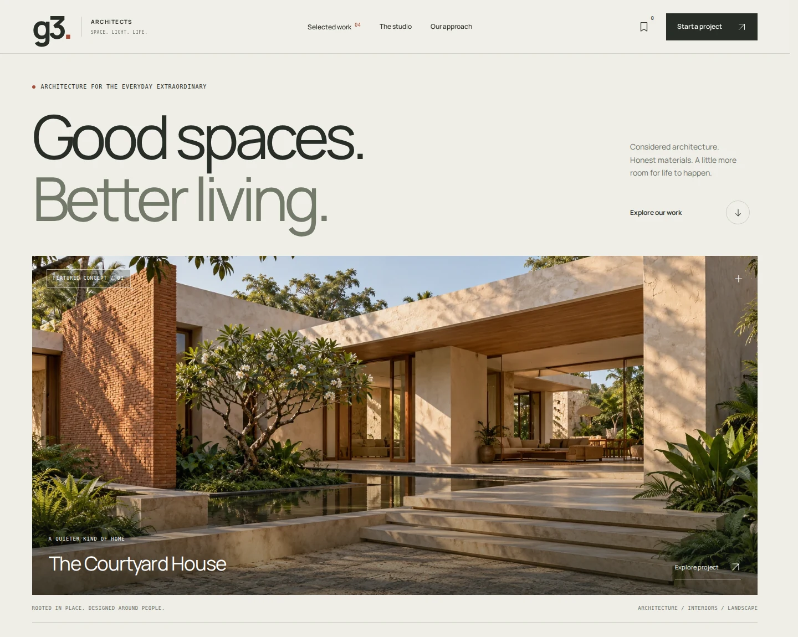

# G3 Architects

**Good spaces. Better living.**

A responsive architecture concept portfolio by [Shayan Abrar](https://github.com/SHAYAN-ABRAR). Reimagined with an editorial layout, five original AI-generated architectural visuals and useful interactions built in plain HTML, CSS and JavaScript.

[Live site](https://shayan-abrar.github.io/G3-Architects-Website/) · [Repository](https://github.com/SHAYAN-ABRAR/G3-Architects-Website)

The live site reflects the redesign after this branch is merged and GitHub Pages completes its deployment.



## The experience

- An asymmetric project gallery with category filters and a compact index view.
- Four detailed design studies, each with an original visual, design intent and material palette.
- A saved-inspiration collection that persists locally in the visitor's browser.
- A three-step project brief with field validation, up to three priorities, editable notes, draft recovery and a UTF-8 text download.
- A responsive approach accordion that changes both the story and its photograph.
- A mobile menu, keyboard-operable native dialogs, focus management and reduced-motion support.

The practice and projects are fictional concepts. AI imagery is disclosed in the portfolio and project details. There are no invented awards, client endorsements or completed-project claims. The brief is a local planning aid: it does not send enquiries or contact details anywhere. No backend, analytics, external runtime libraries or AI API calls are connected.

## Preview locally

Open `index.html` directly in a modern browser. No build step or package installation is required.

For an optional local HTTP preview with Python installed:

```powershell
Set-Location -LiteralPath "C:\path\to\G3-Architects-Website"
python -m http.server 8080
```

Then open <http://localhost:8080>. Stop the server with Ctrl+C.

## Files

| File or folder | Purpose |
| --- | --- |
| `index.html` | Accessible page content, inline icon symbols and dialogs |
| `styles.css` | Design system, responsive layouts and reduced-motion styles |
| `script.js` | Project data, gallery controls, dialogs, saved inspiration and brief builder |
| `assets/images/` | Responsive WebP exports, image provenance and exact prompts |
| `assets/fonts/` | Self-hosted Manrope font subset and its license |
| `assets/favicon.svg` | G3 browser icon |
| `screenshots/redesign-*.webp` | Current desktop and mobile screenshots |
| `images/` and older screenshots | Original repository assets retained for reference |
| `.nojekyll` | Static GitHub Pages delivery |
| `.gitattributes` | Predictable text line endings |

There are no absolute-root asset paths, so the project works at the GitHub Pages repository subpath as well as at a domain root.

## Make it yours

Edit the project copy in `index.html` and the matching project data in `script.js`. Keep the four project IDs consistent between the two files. Replace the image exports in `assets/images/` and update their `srcset` dimensions if the replacements differ.

The main colour and spacing tokens are at the top of `styles.css`. The Manrope font is served locally. SVG icons are defined as symbols near the top of `index.html`.

Saved inspiration uses `g3-saved-v1`; brief drafts use `g3-brief-v1` in local storage. The app validates saved data before restoring it and continues in memory if the browser blocks storage. "Clear draft" removes the current brief fields while retaining saved inspiration. No cookies are set.

## Publish with the included Windows helper

The ZIP contains `Publish-G3-Redesign.ps1` and `START-HERE.txt` next to the project folder. The helper is written for Windows PowerShell 5.1 and newer and does not use `&&`.

1. Save `G3-Architects-Redesign.zip` to Downloads.
2. Run the four lines in `START-HERE.txt`.
3. Review and merge the pull request opened by the helper.
4. Check the Pages deployment in the repository's Actions tab.

The script uses a fresh timestamped review folder and a new `design/g3-architecture-...` branch. It verifies the prepared base, copies the redesign, runs both unstaged and staged Git whitespace checks, and commits/pushes only when `-Push` is supplied. It does not modify existing local clones, force-push or push to main. If the base has changed, it stops before copying files.

Prepared from `main` at `439e057a812314726db2d63ea68ba9894cee6b5b`.

For a simple branch deployment, configure **Settings → Pages → Deploy from a branch → main → / (root)**. If an existing custom Pages workflow is in use, keep its setup and check its run after merging. See the [official GitHub Pages documentation](https://docs.github.com/en/pages/getting-started-with-github-pages/configuring-a-publishing-source-for-your-github-pages-site).

## Validation

Checked on 7 October 2026 with Chromium through Playwright:

- Asset loading under `/G3-Architects-Website/` and direct `file://` preview.
- Four filters, both gallery views, every project dialog and next-project cycling.
- Modal keyboard focus, Escape dismissal and mobile navigation.
- Saved projects, removal and empty state, persistence after reload.
- Required fields, blank-location rejection, area limits and three-priority limit.
- Brief back/edit, draft recovery, reset and actual text download contents.
- User notes rendered as text rather than HTML.
- Malformed stored data and blocked local storage.
- Reduced motion and readable core content with JavaScript disabled.
- Horizontal overflow at 320, 360, 390, 620, 768, 1024, 1440 and 1920 pixels.
- No JavaScript errors or missing page assets during these flows.

The final package also passes real Git whitespace checks, before and after staging, with `core.autocrlf` both off and on. The ZIP is checked for integrity and contains no Git metadata or testing dependencies.

The publishing script has been reviewed for PowerShell 5.1 compatibility; it has not been executed on Windows in this environment. Remote push, pull-request merge and GitHub Pages deployment are left to the repository owner. Other browser engines and assistive technologies have not been exhaustively tested.

## Images and font

Five images were created specifically for this redesign using the built-in image-generation tool: Courtyard House, Quiet Form, Canopy Pavilion, Brick & Light, and the studio model photograph. They depict fictional architectural concepts, not documented buildings. See [image provenance](assets/images/README.md) and [exact prompts](assets/images/prompts.json).

Manrope was sourced from the [Google Fonts repository](https://github.com/google/fonts/tree/main/ofl/manrope), subset for this site's Latin text, and bundled under the [SIL Open Font License](assets/fonts/OFL-Manrope.txt).

The original repository did not specify a project license; this redesign does not add one. Original assets remain subject to their existing ownership and terms.
